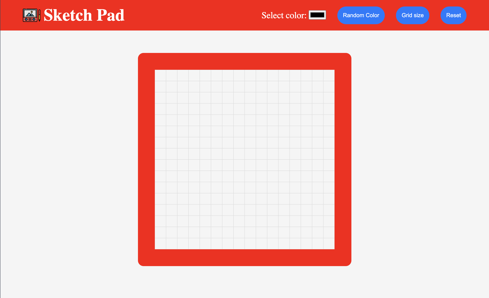

# Etch-A-Sketch
This project is a simple Etch-A-Sketch application created for learning purposes. It allows users to draw on a grid by hovering over the squares with different colors. The goal of this project was to improve HTML, CSS, and JavaScript fundamentals, including DOM manipulation, event handling, etc.

## Features
- Drawing Modes: Users can choose any color they want, or they can opt for a random color mode that changes the color to a random generated color.
- Adjustable Size Grid: The grid can be resized to accomodate different number of squares.
- Reset Functionality: A button to clear the entire board and have a fresh board.

## Live Demo
Check out the live version of the project <a href="https://armenta-i.github.io/etch-a-sketch/">here</a>

# Icons
Icons used in this project were obtained from
<a href="https://www.flaticon.com/free-icons/draw" title="draw icons">Favicon</a>, created by Freepik.